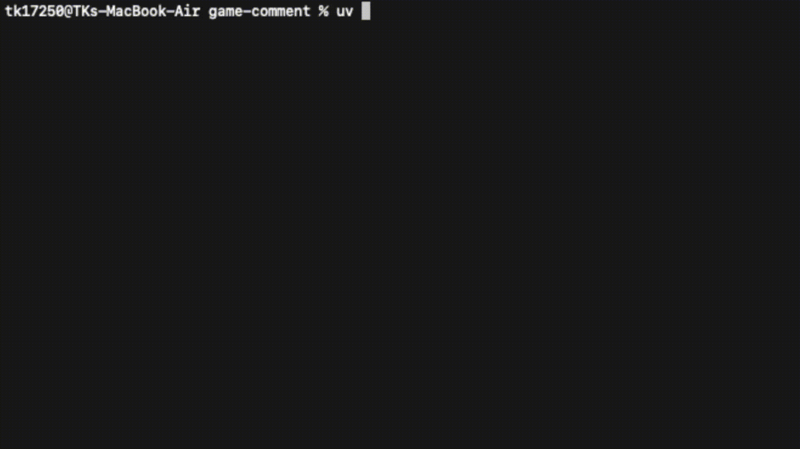

# 🎬 YouTube to Dataset Extractor

[](https://www.python.org/downloads/)
[](LICENSE)

<p align="center">
    
</p>

<!-- <p align="center">
    
</p> -->

A CLI tool to extract frames from YouTube videos at configurable intervals, designed for building image datasets for machine learning and computer vision tasks.

<!-- --- -->
<br>

## ✨ Features

- 🔗 **Two Input Modes** — Enter a YouTube URL directly or use a JSON file for batch processing
- ⏱️ **Flexible Interval** — Capture frames every N seconds (1s, 30s, 60s, etc.)
- 📊 **Preview Before Processing** — See estimated frame counts before starting
- 📁 **Auto-Organized Output** — Frames sorted into folders by category / video title
- 📦 **Auto ZIP Creation** — Ready to distribute or upload immediately
- 🎨 **Beautiful Terminal UI** — Progress bars, tables, and colors powered by Rich

---

## 📋 Prerequisites

### Required Software

| Software | Version | Description |
|----------|---------|-------------|
| **Python** | 3.11+ | Main language runtime |
| **ffmpeg** | latest | Required by yt-dlp for merging audio and video streams |

### Installing ffmpeg

**macOS:**
```bash
brew install ffmpeg
```

**Ubuntu / Debian:**
```bash
sudo apt update && sudo apt install ffmpeg
```

**Windows:**
```bash
# Download from https://ffmpeg.org/download.html
# Or use Chocolatey:
choco install ffmpeg
```

---

## 🚀 Installation

### Option 1: Using uv (Recommended)

```bash
# Clone the repository
git clone https://github.com/TK17250/yt-to-dataset.git
cd yt-to-dataset

# Install dependencies with uv
uv sync
```

### Option 2: Using pip

```bash
# Clone the repository
git clone https://github.com/TK17250/yt-to-dataset.git
cd yt-to-dataset

# Create a virtual environment
python -m venv .venv
source .venv/bin/activate  # macOS/Linux
# or .venv\Scripts\activate  # Windows

# Install dependencies
pip install yt-dlp opencv-python rich
```

---

## 📖 Usage

### Getting Started

```bash
# With uv
uv run python main.py

# Or with pip (activate venv first)
python main.py
```

---

### Mode 1: Enter a YouTube URL Directly

Best for extracting frames from a single video.

```
$ uv run python main.py

╭──────────────────────────────────────────────────────────╮
│                                                          │
│  🎬 YouTube to Dataset Extractor                         │
│  Extract frames from YouTube videos to build             │
│  image datasets                                          │
│                                                          │
│  👤 GitHub: TK17250 (https://github.com/TK17250)        │
│                                                          │
╰──────────────────────────────────────────────────────────╯

📥 Choose video input method:
  [1] Enter a YouTube URL directly
  [2] Use a JSON file (place it in the input/ folder)

👉 Select (1/2): 1
🔗 Enter YouTube URL: https://www.youtube.com/watch?v=dQw4w9WgXcQ

⏱️  How often should frames be captured?
  Examples: 1 = every 1 second, 30 = every 30 seconds, 60 = every 1 minute

👉 Enter interval in seconds: 10

📊 Dataset Summary
┌───────────────────────┬──────────┬──────────┬──────────────┐
│ Title                 │ Duration │ Interval │ Est. Frames  │
├───────────────────────┼──────────┼──────────┼──────────────┤
│ Never Gonna Give Y... │ 03:32    │ every 10s│ ~22          │
└───────────────────────┴──────────┴──────────┴──────────────┘

✅ Proceed with dataset creation? [Y/n]: y
```

---

### Mode 2: Use a JSON File (Batch Processing)

Best for extracting frames from multiple videos, organized by category.

#### Step 1: Create a JSON File

Create a `.json` file and place it in the `input/` folder (or the root directory).

**JSON Format:**

```json
{
    "category_name_1": [
        "https://www.youtube.com/watch?v=VIDEO_ID_1",
        "https://youtu.be/VIDEO_ID_2",
        "https://www.youtube.com/watch?v=VIDEO_ID_3"
    ],
    "category_name_2": [
        "https://www.youtube.com/watch?v=VIDEO_ID_4",
        "https://youtu.be/VIDEO_ID_5"
    ]
}
```

**Example `video_list.json`:**

```json
{
    "category1": [
        "https://www.youtube.com/watch?v=VIDEO_ID_1",
        "https://www.youtube.com/watch?v=VIDEO_ID_2"
    ],
    "category2": [
        "https://www.youtube.com/watch?v=VIDEO_ID_3",
        "https://www.youtube.com/watch?v=VIDEO_ID_4"
    ]
}
```

#### Step 2: Run the Program

```
$ uv run python main.py

👉 Select (1/2): 2

📂 JSON files found:
  [1] input/video_list.json
  [2] video_list.json

👉 Select file: 1

⏱️  How often should frames be captured?
👉 Enter interval in seconds: 30

📊 Dataset Summary
┌─────────────────┬─────────┬──────────────┬──────────────┐
│ Category        │ Videos  │ Total Dur.   │ Est. Frames  │
├─────────────────┼─────────┼──────────────┼──────────────┤
│ category1       │ 2       │ 15:23        │ ~31          │
│ category2       │ 2       │ 12:10        │ ~25          │
├─────────────────┼─────────┼──────────────┼──────────────┤
│ Total           │ 4       │ 27:33        │ ~56          │
└─────────────────┴─────────┴──────────────┴──────────────┘

✅ Proceed with dataset creation? [Y/n]: y

🔄 Processing category1 (1/2)...
  ↳ [1/2] Video Title Here
    Downloading...
    ✓ 15 frames
  ↳ [2/2] Another Video Title
    Downloading...
    ✓ 16 frames

🔄 Processing category2 (2/2)...
  ...

📦 Creating ZIP file...
✓ ZIP created successfully (12.3 MB)

╭──────────────────────────────────────────────────╮
│  🎉 Dataset created successfully!                │
│                                                  │
│  📁 Folder: output/dataset_20260502_152853/      │
│  📦 ZIP: output/dataset_20260502_152853.zip      │
│  🖼️  Frames: 56 images                           │
╰──────────────────────────────────────────────────╯
```

---

## 📁 Output Structure

### Single URL Mode

```
output/
└── dataset_20260502_152853/
    ├── Video_Title/
    │   ├── frame_0001.jpg
    │   ├── frame_0002.jpg
    │   ├── frame_0003.jpg
    │   └── ...
    └── summary.json
```

### JSON Mode (Multiple Categories)

```
output/
└── dataset_20260502_152853/
    ├── category1/
    │   ├── Video_Title_1/
    │   │   ├── frame_0001.jpg
    │   │   ├── frame_0002.jpg
    │   │   └── ...
    │   └── Video_Title_2/
    │       └── ...
    ├── category2/
    │   └── ...
    └── summary.json
```

### summary.json

Every dataset includes a `summary.json` file containing metadata:

```json
{
  "created_at": "2026-05-02T15:28:53",
  "interval_seconds": 30,
  "total_frames": 253,
  "categories": {
    "category1": {
      "video_count": 7,
      "videos": [
        {
          "title": "Video Title",
          "url": "https://www.youtube.com/watch?v=...",
          "duration": 360
        }
      ]
    }
  }
}
```

---

## ⚙️ Configuration

### Interval Guide

| Interval | Use Case | Approx. Result (10 min video) |
|----------|----------|-------------------------------|
| `1` second | Very detailed dataset | ~601 frames |
| `5` seconds | Medium detail | ~121 frames |
| `10` seconds | Balanced quantity and quality | ~61 frames |
| `30` seconds | Key snapshots only | ~21 frames |
| `60` seconds | Video overview | ~11 frames |

---

## 🛠️ Dependencies

| Package | Version | Purpose |
|---------|---------|---------|
| [yt-dlp](https://github.com/yt-dlp/yt-dlp) | ≥2026.3.17 | Download videos from YouTube |
| [opencv-python](https://github.com/opencv/opencv-python) | ≥4.13.0 | Read videos and extract frames |
| [rich](https://github.com/Textualize/rich) | ≥15.0.0 | Terminal UI (progress bars, tables, colors) |

---

## 🤝 Contributing

1. Fork this repository
2. Create your feature branch: `git checkout -b feature/amazing-feature`
3. Commit your changes: `git commit -m 'Add amazing feature'`
4. Push to the branch: `git push origin feature/amazing-feature`
5. Open a Pull Request

---

## 👤 Author

**TK17250** — [GitHub](https://github.com/TK17250)

---

## 📝 License

This project is licensed under the MIT License — see the [LICENSE](LICENSE) file for details.

---

## ⚠️ Disclaimer

This tool is intended for educational and research purposes. Please respect YouTube's Terms of Service and the copyright of video creators. Always ensure you have the right to use the content you download.
